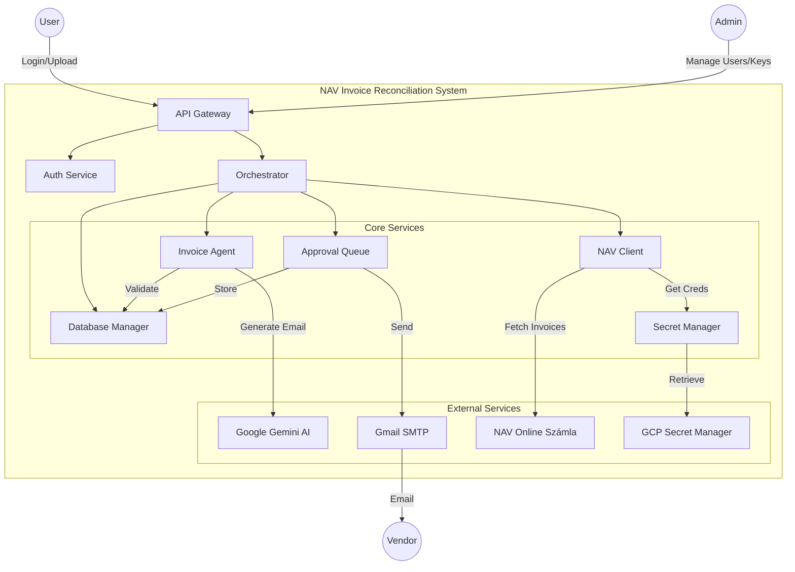
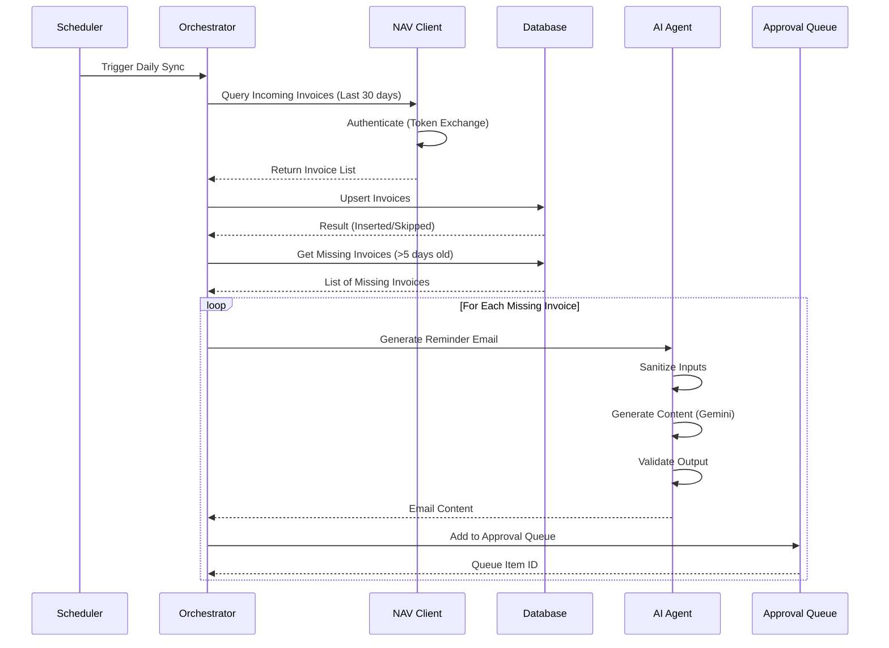
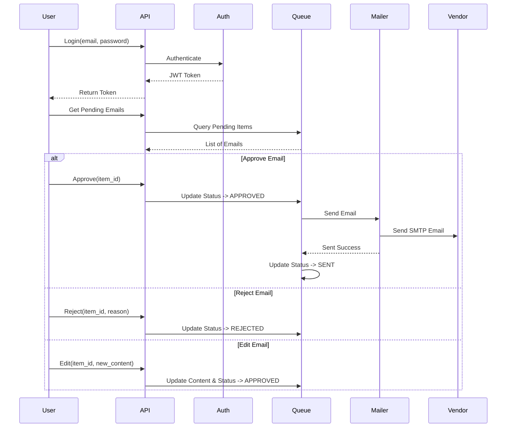

# NAV Invoice Reconciliation System Architecture

This document describes the architecture of the NAV Invoice Reconciliation System, an automated solution for tracking, reconciling, and chasing missing invoices using the Hungarian Tax Authority (NAV) Online Számla API and AI-powered email generation.

## 1. System Overview

The system is designed to bridge the gap between invoices reported to NAV and the actual PDF receipts available to the accounting team. It automates the detection of missing invoices and facilitates professional communication with vendors to request them.

### Key Capabilities
- **Automated Sync**: Daily synchronization with NAV Online Számla v3.0 API.
- **Missing Invoice Detection**: Identifies invoices reported to NAV but missing from local records.
- **AI-Powered Chasing**: Generates professional, context-aware reminder emails using Google Gemini.
- **Human-in-the-loop**: Approval queue for reviewing AI-generated emails before sending.
- **Security**: Enterprise-grade security with RBAC, encrypted credential storage, and audit logging.

## 2. High-Level Architecture

The system follows a modular architecture with clear separation of concerns.

## 3. Core Components

### 3.1 NAV Client (`nav_client.py`)
Handles all communication with the NAV Online Számla v3.0 API.
- **Features**:
  - Implements complex XML signature generation (SHA3-512).
  - Handles token exchange and session management.
  - Validates invoices against September 2025 blocking rules.
  - Automatic retry with exponential backoff for transient errors.
  - Rate limiting compliance (1 request/second).

### 3.2 Invoice Agent (`invoice_agent.py`)
AI agent responsible for generating professional communication.
- **Features**:
  - **Input Sanitization**: Prevents prompt injection attacks.
  - **Context-Aware Generation**: Uses invoice metadata to craft specific messages.
  - **Tone Adjustment**: Supports multiple escalation levels (Polite → Firm → Urgent).
  - **Output Validation**: Detecting hallucinations (wrong amounts/numbers) before approval.

### 3.3 Database Manager (`database_manager.py`)
Manages persistence for invoices and audit logs.
- **Features**:
  - **Multi-Tenancy**: Strict data isolation using `tenant_id`.
  - **Audit Logging**: Tracks all status changes for compliance (GDPR).
  - **Schema**: SQLite based (extensible to PostgreSQL).
  - **Status Tracking**: Tracks lifecycle: `MISSING` → `RECEIVED` or `EMAILED` → `ESCALATED`.

### 3.4 Approval Queue (`approval_queue.py`)
Implements the human-in-the-loop workflow.
- **Features**:
  - Queues AI-generated emails for review.
  - Supports Approve, Reject, and Edit workflows.
  - Tracks reviewer actions and timestamps.
  - Handles expiration of stale queue items.

### 3.5 Auth Service (`auth.py`)
Manages authentication and authorization.
- **Features**:
  - **RBAC**: Role-Based Access Control (Admin, Accountant, Site Manager).
  - **JWT**: Stateless authentication with access/refresh tokens.
  - **Security**: Bcrypt password hashing and robust validation.

### 3.6 Secret Manager (`nav_secret_manager.py`)
Securely stores sensitive credentials.
- **Features**:
  - Integration with Google Cloud Secret Manager.
  - Encryption at rest.
  - In-memory caching with TTL to minimize API calls.
  - Multi-tenant isolation for credentials.

## 4. Key Workflows

### 4.1 Daily Synchronization Flow
This process runs daily to fetch new invoices and identify missing ones.

### 4.2 Approval & Sending Flow
This workflow involves human review of the generated emails.

## 5. Security Architecture

### 5.1 Credential Management
- NAV Technical User credentials are **never** stored in code or plain text configuration files.
- They are stored in **Google Cloud Secret Manager**.
- Access is restricted via IAM roles.
- The application retrieves them only when needed and caches them briefly in memory.

### 5.2 Input Validation
- The `InputSanitizer` class in `invoice_agent.py` strips potential prompt injection attacks before sending data to the AI model.
- All API inputs are validated against strict schemas.

### 5.3 Output Validation
- The `OutputValidator` ensures the AI hasn't hallucinated data.
- It verifies that the invoice number and amount in the generated email match the database record exactly.
- It blocks sensitive patterns (e.g., unexpected credit card numbers).

### 5.4 Access Control
- **Admin**: Full system access.
- **Accountant**: Operational access (view invoices, approve emails).
- **Site Manager**: Limited access (upload receipts only).

## 6. Technology Stack

- **Language**: Python 3.10+
- **Database**: SQLite (Development), PostgreSQL (Production)
- **AI Model**: Google Gemini 1.5 Flash (via `google-genai` SDK)
- **Cloud Provider**: Google Cloud Platform (Secret Manager)
- **Authentication**: JWT + Bcrypt
- **External API**: NAV Online Számla v3.0 (XML/Rest)

## 7. Deployment Considerations

- **Environment Variables**:
  - `GOOGLE_APPLICATION_CREDENTIALS`: Path to GCP service account key.
  - `JWT_SECRET_KEY`: High-entropy secret for token signing.
  - `GEMINI_API_KEY`: API key for Google Gemini.
  - `GCP_PROJECT_ID`: Google Cloud Project ID.
- **Dependencies**: Listed in `requirements.txt`.
