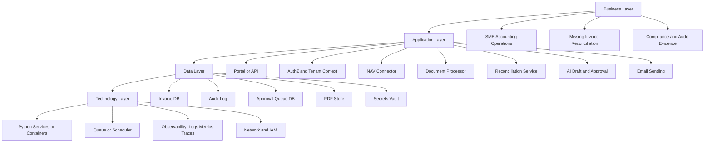
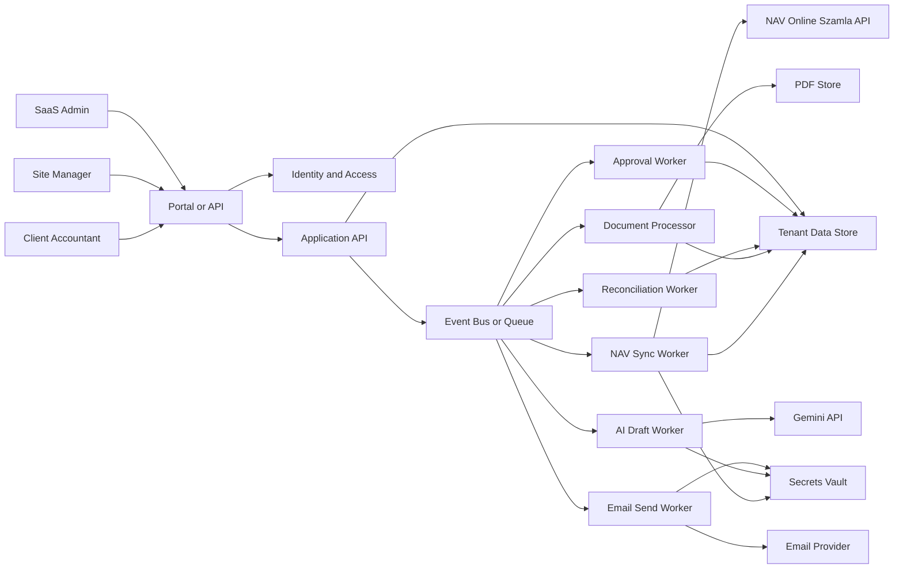
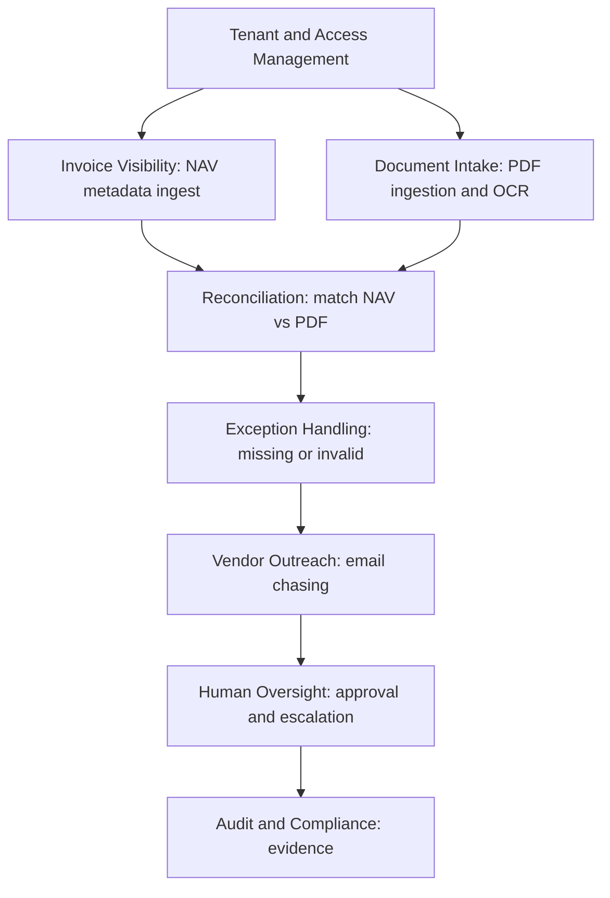
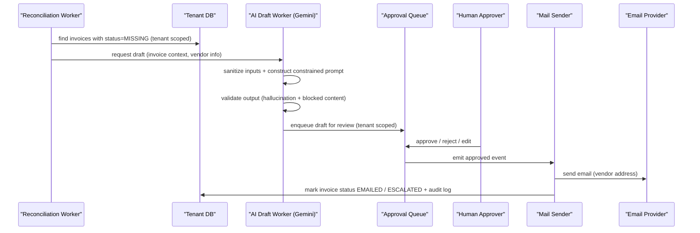
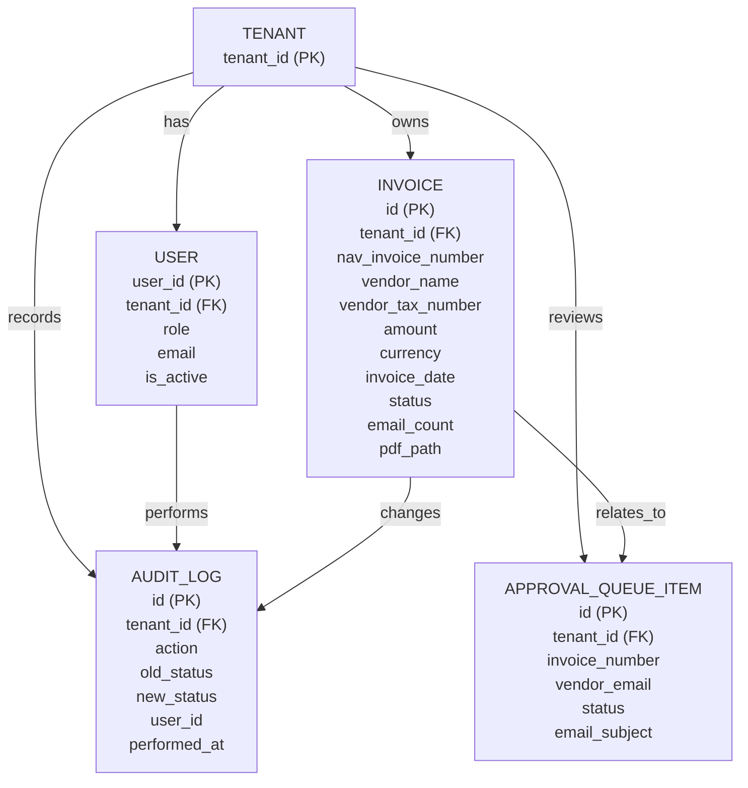

## NAVvoice Architecture (TOGAF‑Aligned)

**Version**: 1.0  
**Date**: 2025-12-16  
**Scope**: NAV Online Számla invoice reconciliation + AI chasing workflow for Hungarian SME accounting operations.

---

## 1) Architecture Vision (TOGAF ADM Phase A)

### Drivers
- **Regulatory compliance**: Hungarian NAV Online Számla reporting; September 2025 stricter validations; 8‑year retention.
- **Operational risk reduction**: prevent missing invoice PDFs that block bookkeeping and VAT reclaim.
- **Security & privacy**: protect NAV technical user credentials, invoices (financial data), and business contact data (GDPR).
- **Scale & resilience**: support multiple tenants (SMEs) and increasing invoice volume without system‑wide failures.

### Target Outcomes
- **Detect missing invoices** by reconciling NAV invoice metadata vs received PDFs.
- **Automate vendor outreach** using an AI agent with **human approval** where required.
- **Maintain tenant isolation** end‑to‑end (data, secrets, processing, audit).
- **Enable extensibility**: modular architecture supports future integrations (additional invoice sources, ERP connectors) without breaking core NAV functionality.

### Stakeholders (Typical)
- **Client**: Accounting Manager, Bookkeeper, Site Manager (PDF uploader)
- **SaaS Operator**: Support, Security Officer, Platform Engineer
- **External**: NAV API, Email providers, LLM provider (Gemini), Cloud provider

---

## 2) Baseline vs Target Architecture (TOGAF Content Framework)

### Baseline (as implemented in this repo)
**Core building blocks (SBBs mapped to code):**
- NAV API integration: `nav_client.py` (`NavClient`, crypto, rate limiting, retries)
- Tenant secrets vault: `nav_secret_manager.py` (`NavSecretManager` over GCP Secret Manager)
- Tenant data store: `database_manager.py` (SQLite, tenant‑scoped tables + audit log)
- Document processing: `pdf_scanner.py` (folder scan + PDF text/optional OCR extraction)
- AI drafting + sending: `invoice_agent.py` (Gemini integration, prompt‑injection protection, SMTP sender)
- Human approval workflow: `approval_queue.py` (SQLite queue + action log)
- AuthN/Z blueprint: `auth.py` (JWT + RBAC abstractions; not yet wired to a web API)

**Key constraint**: The NAV API client has extensive unit tests; **live NAV test-environment execution remains a separate operational step** (see `test_nav_live_api.py` + setup docs).

### Target (platform-ready, TOGAF Phase D design)
Move from “single-process scripts” to **stateless services** coordinated via a **message bus**, with clear separation of concerns:
- **API Layer** (tenant + user identity, admin, dashboards)
- **Domain Adapters** (NAV connector, Email connector, Document connector)
- **Processing Workers** (NAV sync, document extraction, reconciliation, AI draft, approval, send)
- **Core Platform Services** (tenant registry, authZ, secrets, audit, observability)

### Target layered view (Business / Application / Data / Technology)

---

## 3) Solution Concept Diagram (high-level context)

**Notes**
- **Baseline** today implements most boxes as Python modules; **Target** formalizes them as separately deployable services.
- Tenant context is a **first-class request attribute** enforced by authZ and persisted in all data records.

---

## 4) Business Architecture (TOGAF ADM Phase B)

### Business Capabilities (capability map)

### Value Stream (simplified)
1. **Sync invoices from NAV** → 2. **Ingest PDFs** → 3. **Match & detect gaps** → 4. **Draft outreach** → 5. **Approve (if required)** → 6. **Send** → 7. **Track outcomes & audit**

---

## 5) Application Architecture (TOGAF ADM Phase C)

### Application Building Blocks (ABB → SBB mapping)
- **NAV Connector** → `NavClient` (`nav_client.py`)
- **Tenant Secret Vault** → `NavSecretManager` (`nav_secret_manager.py`) backed by GCP Secret Manager
- **Invoice State Store** → `DatabaseManager` (`database_manager.py`) (SQLite today; Postgres recommended for target)
- **Document Extraction** → `PDFScanner` / `PDFContentExtractor` (`pdf_scanner.py`)
- **AI Drafting Agent** → `InvoiceAgent` (`invoice_agent.py`) with input/output guards
- **Human Approval** → `ApprovalQueue` (`approval_queue.py`)
- **Identity & Authorization** → `AuthService/JWTManager` (`auth.py`) (integration layer pending)

### Key workflow (sequence): “Missing invoice → AI draft → Approval → Send”

---

## 6) Data Architecture (TOGAF ADM Phase C)

### Core Entities (logical)

### Data classification (minimum)
- **CRITICAL**: NAV credentials (technical user login/password + signing/exchange keys) → secrets vault only.
- **HIGH**: Invoice PDFs, invoice metadata, vendor contacts → encryption at rest + strict tenant isolation.
- **MEDIUM**: Operational logs/metrics (must avoid leaking PII/secrets).

---

## 7) Technology Architecture (TOGAF ADM Phase D)

### Baseline deployment (single-node reference)
- **Runtime**: Python processes (CLI/scheduled scripts)
- **Data**: SQLite (`data/*.db`)
- **Documents**: local filesystem (`data/pdfs/`)
- **Secrets**: environment variables *or* GCP Secret Manager
- **Email**: SMTP (Gmail app password) / future: provider API

### Target deployment (cloud & scale)
- **Compute**: containerized services (Kubernetes / Cloud Run)
- **Data**: PostgreSQL (tenant-row security + indexing), optional read replicas
- **Documents**: object storage (GCS/S3) + malware scanning pipeline
- **Secrets**: managed secrets vault (GCP Secret Manager / AWS Secrets Manager) with rotation
- **Messaging**: Pub/Sub / RabbitMQ / SQS for async agents and horizontal scaling
- **Observability**: OpenTelemetry traces + metrics + centralized logging (SIEM export)

---

## 8) Security Architecture (cross‑cutting)

### Trust boundaries (must be explicit)
- **Tenant boundary**: every request and record carries `tenant_id`; enforce in authZ and queries.
- **Secret boundary**: credentials never persist outside secrets vault; cache only in memory with TTL.
- **LLM boundary**: sanitize all inputs; validate all outputs; block URLs/unknown emails/secret patterns.
- **Email boundary**: apply allow‑lists, DMARC/SPF/DKIM checks (ingress) and policy controls (egress).

### Access control model
- **RBAC**: Admin / Accountant / Site Manager (existing model in `auth.py`)
- **Tenant authorization**: user ↔ tenant matrix; users only access data within their assigned tenant(s)

---

## 9) Architecture Roadmap (baseline → target)

### Transition steps (minimal risk)
- **T1: Stabilize tenant boundaries**: ensure all non-test modules pass tenant_id consistently; align approval + mail + scanning flows with DB tenant scoping.
- **T2: Introduce API façade** (FastAPI): authentication, tenant context propagation, admin operations.
- **T3: Event-driven processing**: job queue for NAV sync, scanning, reconciliation, AI drafting, approval, send.
- **T4: Replace SQLite where needed**: move to Postgres + object storage; add immutable audit retention.

---

## 10) What "done" looks like (acceptance criteria)
- **Functional completeness**: NAV invoice reconciliation features work correctly end‑to‑end (including live NAV test env verification).
- **Security**: tenant-scoped access controls; secrets protected; strong audit trail; safe LLM usage.
- **Scalability**: workers stateless; queue-backed horizontal scaling.
- **Error handling**: component failures degrade locally (retries/circuit breakers) without system-wide outage.

