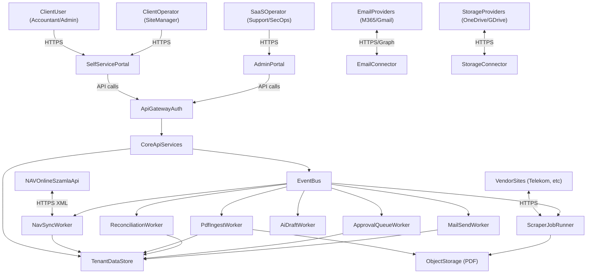
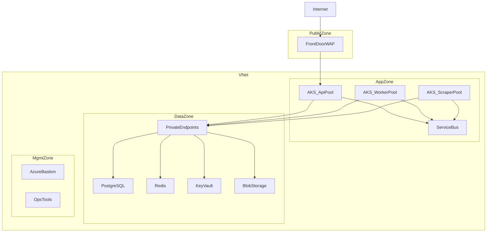
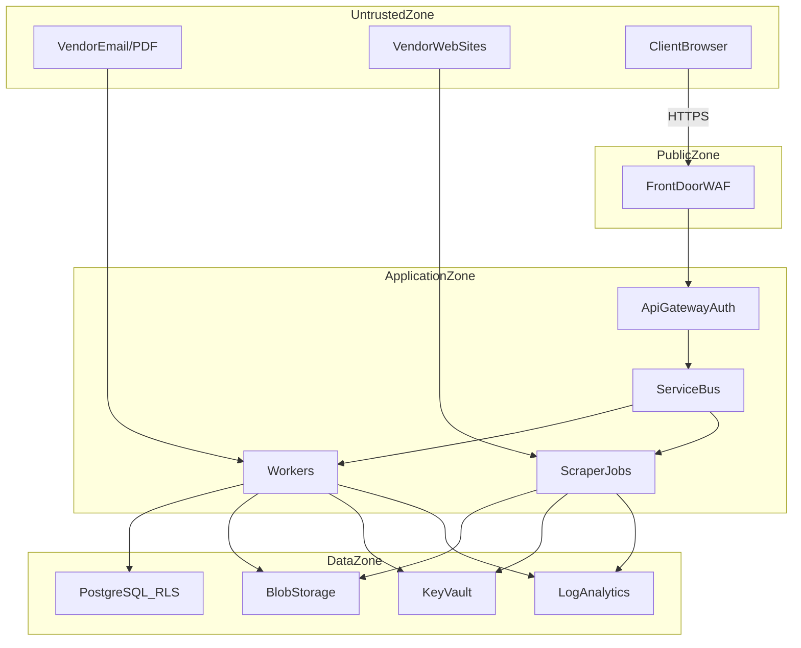

## Vezetői összefoglaló

Ez a dokumentum a tervezett **multi-tenant SaaS** rendszer **Azure** célkörnyezetre illesztett, magas- és középszintű **architektúráját, topológiáját, biztonsági modelljét és üzemeltetési tervét** rögzíti.

A terv célja, hogy:
- **auditálható** legyen (trust boundary-k, hozzáférések, naplózás, DR),
- **skálázható** legyen (stateless komponensek, üzenetsorok, horizontális skálázás),
- **hibatűrő** legyen (retry/circuit breaker/dead-letter, graceful degradation),
- **multi-tenant** szeparációt garantáljon request → service → DB szinten,
- és **domain-agnosztikus platformmagot** adjon (a számla-egyeztetés egy domain-modul; más domain is ráültethető).

## 1. Cél, terjedelem, feltételezések

### 1.1 Cél
- **Rendszerterv**: komponensek, felelősségek, interfészek, adatáramlások.
- **Topológia**: zónák, hálózat, egress/ingress, privát végpontok.
- **Biztonság**: identity, jogosultság, titokkezelés, titkosítás, threat model.
- **Üzemeltetés**: megfigyelhetőség, incidenskezelés, backup/restore, DR.

### 1.2 In-scope
- Multi-tenant SaaS architektúra (tenant izoláció + domain-szintű hozzáférés).
- Integrációk: **NAV Online Számla API**, email (M365/Gmail), storage (OneDrive/Google Drive/Azure Blob), opcionális web-scraper réteg.
- Dokumentum-feldolgozás: PDF ingest, malware-szűrés, OCR (opcionális), meta-kinyerés, egyeztetés.
- AI/agent komponensek: email vázlat generálás, human approval.

### 1.3 Out-of-scope (ebben a dokumentumban)
- Részletes UI/UX képernyőtervek.
- Konkrét adatbázis táblaszintű DDL minden mezővel (logikai modell + kritikus indexek szerepelnek).
- Teljes jogi szerződéses csomag (DPA/SCC/TIA) – csak architektúra követelmények.

### 1.4 Feltételezések és alap döntések (javasolt defaultok)
- **Azure régió**: EU (pl. `westeurope`), prod és DR régió elkülönítve (pl. `northeurope`).
- **Környezetek**: dev / staging / prod külön előfizetésben vagy legalább külön resource groupban.
- **Identitás**: Entra ID (belső admin) + Entra External ID/B2C (ügyfél felhasználók) vagy SSO integráció (OIDC/SAML) a nagyobb tenantoknak.
- **Compute**: AKS (szigorú izoláció + hálózati policy-k + job-alapú futtatások miatt); alternatívaként Container Apps a kisebb ops terheléshez.
- **Üzenetsor**: Azure Service Bus (queue + topic; DLQ; scheduled messages).
- **Adattár**: Azure Database for PostgreSQL (Flexible Server) + RLS; Redis cache; Blob Storage dokumentumoknak; Key Vault titkoknak.

## 2. Követelmények

### 2.1 Funkcionális követelmények (rendszerszint)
- **NAV szinkron**: számla metaadatok periodikus letöltése (rate limit: 1 req/s/IP) és tárolása tenant-szinten.
- **PDF ingest**: beérkező PDF-ek fogadása (email, storage sync, manuális upload), malware-szűrés, kinyerés (text/OCR), tárolás.
- **Egyeztetés (reconciliation)**: NAV metaadat ↔ PDF matching, hiányzó számlák detektálása.
- **Értesítés / vendor chasing**: email draft generálás, jóváhagyás, küldés és állapotkövetés.
- **Human-in-the-loop**: approval queue, audit trail, szerkesztés/jóváhagyás/elutasítás.
- **Tenant admin**: integrációk beállítása, jogosultságok, kulcsok/konnektorok kezelése.

### 2.2 Nem-funkcionális követelmények
- **SLO (javaslat)**:
  - API: 99.9% havi rendelkezésre állás.
  - Aszinkron feldolgozás: 99.5% (job sikeresség + backlog kontroll).
  - P95 API latency: < 500 ms (read), < 1500 ms (write) normál terhelésen.
- **RTO/RPO (javaslat)**:
  - RTO: 4 óra, RPO: 1 óra (prod szolgáltatások).
- **Adatmegőrzés**:
  - Számla és audit: 8 év (magyar számviteli követelmények).
  - Biztonsági logok: minimum 180 nap online + archiválás igény szerint.
- **Skálázás**:
  - Minden feldolgozó komponens stateless, horizontálisan skálázható.
  - Üzenetsor alapú feldolgozás; idempotencia; DLQ.
- **Biztonság**:
  - Tenant izoláció end-to-end, auditálható enforcement.
  - Titokkezelés: Key Vault + Managed Identity.
  - Egress korlátozás (különösen scraper joboknál): whitelist alapú.
- **Domain-agnosztikusság**:
  - Platformmag nem feltételez “számla” specifikumot; domain modulok cserélhetőek.

## 3. Architektúra áttekintés (C4-szemlélet)

### 3.1 Rendszerkontekstus (kik és mivel integrálunk)

### 3.2 Konténer nézet (fő komponensek)

**Kliens és edge**
- **SelfServicePortal**: ügyfél UI (beállítások, státuszok, jóváhagyások).
- **AdminPortal**: üzemeltetői UI (tenant menedzsment, támogatás, audit).
- **ApiGatewayAuth**: hitelesítés (OIDC), autorizáció (RBAC + domain policy), rate limit, request validation.

**Core szolgáltatások**
- **CoreApiServices**: számla/dokumentum domain API, tenant config API, approval API.
- **EventBus**: job dispatch és események (queue/topic), retry + DLQ.

**Integrációs és feldolgozó réteg**
- **NavSyncWorker**: NAV lekérdezések, rate limit, idempotens ingest.
- **EmailConnector**: bejövő/kimenő email integráció (Graph/Gmail).
- **StorageConnector**: OneDrive/GDrive szinkron, watch, ingest.
- **PdfIngestWorker**: malware-scan, extract/OCR, objektumtár feltöltés.
- **ReconciliationWorker**: egyeztetés, hiány detektálás, workflow indítás.
- **AiDraftWorker**: email draft + guardrail (prompt injection / output validation).
- **ApprovalQueueWorker**: human approval queue kezelés, audit.
- **MailSendWorker**: kimenő email küldés (provider API), bounce tracking.
- **ScraperJobRunner**: izolált, rövid életű scraper jobok (ephemeral).

**Adat réteg**
- **TenantDataStore**: PostgreSQL (RLS + indexek + audit).
- **ObjectStorage (PDF)**: Azure Blob + immutability/retention policy.
- **Cache/Locks**: Redis (rate limiting, job locks, short-lived tokens).
- **Secrets**: Key Vault (tenant/provider secret naming + rotation).

## 4. Meglévő 4 oldalas terv (megőrzött mag) – kibővítve

### 4.1 Zónák (eredeti logika)

**1) Public Zone (Nyilvános zóna)**
- Load Balancer & WAF (HTTPS terminálás, OWASP Top 10, DDoS).
- CDN (statikus tartalmak gyors kiszolgálása).

**2) Application Zone (Alkalmazás zóna – private)**
- Self-service portal kiszolgálás.
- API Gateway / Auth Service (multi-tenancy enforcement).
- Core Services (üzleti logika, értesítések).
- Integration & Workers (scraper, email/storage workers).

**3) Data Zone (Adat zóna – restricted)**
- PostgreSQL (multi-tenancy: particionálás/schema separation vagy RLS).
- Credential Vault (kritikus: külső szolgáltatói belépési adatok).
- Redis (cache, session, job queue, transient).

### 4.2 Biztonsági fókusz (eredeti logika)
- **Credential Vault védelme**: ipari standard (Azure Key Vault / Vault), audit, least privilege.
- **Scraper izoláció**: ephemeral konténerek, külön egress, DB direct tiltás.
- **Tenancy izoláció**: Tenant ID minden query-ben; DB szintű enforce.
- **Network policies / egress filtering**: céloldalak whitelist, minimális belső hozzáférés.

## 5. Azure topológia és hálózati szegmentáció (részletes)

### 5.1 Szolgáltatás-mapping (logikai komponens → Azure)

| Logikai komponens | Azure szolgáltatás (ajánlott) | Megjegyzés |
|---|---|---|
| Edge WAF + globális belépési pont | Azure Front Door Premium + WAF | CDN funkcióval; Private Link origin (opcionális) |
| DNS | Azure DNS | Egyedi domain + TXT (SPF/DKIM/DMARC) |
| Portal statikus tartalom | Azure Static Web Apps vagy Blob Static Website | Front Door mögött |
| API/Workers/Scraper | AKS (külön node pool-ok) | KEDA autoscale, Network Policy |
| Event bus | Azure Service Bus | DLQ, scheduled messages |
| Relációs DB | Azure Database for PostgreSQL Flexible Server | Private Endpoint, PITR backup |
| Cache/locks | Azure Cache for Redis | Private Endpoint, TLS |
| Dokumentumtár | Azure Blob Storage | Private Endpoint, immutability, lifecycle |
| Titokkezelés | Azure Key Vault (+ Managed HSM ha kell) | RBAC, audit logs |
| Observability | Azure Monitor + App Insights + Log Analytics | OTel javasolt |
| SIEM (opcionális) | Microsoft Sentinel | Log Analytics workspace-re épül |

### 5.1.1 Erőforrás-szegmentálás (javasolt Resource Group bontás)

**Elv**: hálózat és security külön RG-ben; app/workload külön; adatszolgáltatások külön; mindez környezetenként ismételve.

Példa (prod):
- `rg-navvoice-prod-network`: VNet, subnetek, route table, NSG, Firewall, Private DNS.
- `rg-navvoice-prod-edge`: Front Door, WAF policy, DNS rekordok.
- `rg-navvoice-prod-app`: AKS, ACR, Service Bus.
- `rg-navvoice-prod-data`: PostgreSQL, Redis, Storage, Key Vault.
- `rg-navvoice-prod-ops`: Monitor/App Insights/Log Analytics, Sentinel, alert rules.

### 5.1.2 Ingress (Front Door → privát origin)

**Ajánlott útvonal** (privát data plane):
- Azure Front Door Premium + WAF → **Private Link origin** → AKS Ingress (Internal Load Balancer)

Előnyök:
- az API origin **nem publikus**, csak Front Dooron keresztül érhető el,
- edge WAF + bot/dos védelem egy helyen,
- egyszerűbb “PublicZone → AppZone” trust boundary.

Alternatíva (ha szükséges):
- Front Door → Application Gateway (WAF v2) → AKS (AGIC)  
  (dupla L7 réteg, több üzemeltetés; csak akkor javasolt, ha App Gateway specifikus igény van)

### 5.1.3 TLS és tanúsítvány menedzsment

- **Edge TLS**: Front Door managed certificate vagy Key Vault certificate.
- **App TLS**: API belső ingress TLS (akár self-managed + rotáció), vagy mTLS service mesh-sel.
- **Titkos anyagok**: cert private key **Key Vaultban**, app oldalon Managed Identity-vel.

### 5.2 Hálózati topológia (VNet + zónák)

**Elv**: a data plane komponensek **nem kapnak public IP-t**, minden PaaS elérés Private Endpointen történik, az egress kontrollált (NAT + Firewall).

Javasolt zónák/subnetek (példa):
- `snet_app`: API + core services (AKS node pool)
- `snet_workers`: NAV/pdf/AI/mail worker node pool
- `snet_scraper`: scraper job node pool (külön route table + firewall)
- `snet_data_pe`: Private Endpoint subnet (Postgres/Redis/Storage/KeyVault)
- `snet_mgmt`: bastion/jump/ops tooling (csak admin)

#### 5.2.1 Subnet/NSG baseline szabályok (minimum)

| Subnet | Inbound engedély | Outbound engedély | Megjegyzés |
|---|---|---|---|
| `snet_app` | csak Front Door/Ingress (443) + belső service-to-service | Private Endpoints + Service Bus + szükséges külső (pl. NAV) | API és core |
| `snet_workers` | csak belső (SB trigger, health) | Private Endpoints + Service Bus + LLM/email/providers | feldolgozók |
| `snet_scraper` | csak belső (SB trigger) | **Firewallon keresztül**: FQDN allowlist + Private Endpoints (KV/Blob/SB) | külön RT/NSG |
| `snet_data_pe` | csak VNet-ből | csak VNet-ből | PaaS private endpoints |
| `snet_mgmt` | csak admin IP-k / JIT | korlátozott (ops tooling) | Bastion/jump |

Megjegyzés: konkrét portok és címkék a választott ingress/controller és PaaS private endpointok szerint finomítandók (443/TLS domináns).

#### 5.2.2 Private Endpoint + Private DNS (javasolt)

**Elv**: minden PaaS, ami támogatja, Private Endpointen keresztül érhető el az AKS-ből.

Tipikus Private DNS zónák (Azure):
- PostgreSQL: `privatelink.postgres.database.azure.com`
- Key Vault: `privatelink.vaultcore.azure.net`
- Blob Storage: `privatelink.blob.core.windows.net`
- Redis: `privatelink.redis.cache.windows.net`
- Service Bus: `privatelink.servicebus.windows.net`
- Container Registry (ACR): `privatelink.azurecr.io`

#### 5.2.3 AKS hálózati alapok (javasolt)

- **Network plugin**: Azure CNI (vagy overlay, ha IP-korlát kritikus).
- **Network Policy**: engedélyezve (Calico/Azure), zónánkénti szabályokkal:
  - scraper podok: **tiltás DB felé**, engedély csak `ServiceBus`, `Blob`, (opcionális) `KeyVault`.
  - workers: engedély az adott PaaS-hoz + szükséges külső végpontokhoz.
- **Ingress**: internal load balancer (privát), Front Door Private Link origin mögött.

#### 5.2.4 PaaS hálózati “public access” tiltások (javasolt baseline)

**Cél**: minimalizálni a publikus felületeket.

- PostgreSQL Flexible Server: **Public network access disabled** + Private Endpoint.
- Key Vault: **Public network access disabled** + Private Endpoint.
- Storage account: **Public network access disabled** + Private Endpoint; SAS tokenek minimalizálása.
- Service Bus: Private Endpoint; public elérés tiltása, ha a működés engedi.
- Redis: Private Endpoint + TLS, public access tiltás.

#### 5.2.5 DDoS / WAF / rate limiting (edge baseline)

- **WAF policy**: OWASP CRS + custom szabályok (pl. admin endpoint védelem, IP allowlist ops felületre).
- **Rate limit**: Front Door/WAF (durva volumetrikus és bot); alkalmazás oldalon tenant/user limit is.
- **DDoS**: Azure DDoS Network Protection (ha a kockázat/kitettség indokolja), különösen publikus végpontoknál.

### 5.3 Egress kontroll (különösen scraper)

**Cél**: a scraper jobok csak a szükséges külső FQDN-eket érjék el; minden más tiltott.

Javaslat:
- `snet_scraper` route table → **Azure Firewall** (vagy 3rd party NVA).
- Azure Firewall **Application Rules**: FQDN allowlist (pl. `*.telekom.hu`, `*.nav.gov.hu`).
- `snet_app` és `snet_workers` egress: NAT + firewall policy (szűkebb szabályok).

#### 5.3.1 “Egress-only” minták scraperhez (konkrét)

**Minimum cél**: a scraper job *ne tudjon* laterálisan mozogni a belső hálózatban.

Javasolt kombináció:
- **UDR**: `snet_scraper` default route → Azure Firewall.
- **Firewall application rules**: allowlist csak a szükséges FQDN-ekre.
- **Network Policy** az AKS-ben: deny-all + explicit allow (SB/Blob/KV).
- **Workload separation**: dedikált node pool + taint/toleration:
  - `pool=scraper:NoSchedule` taint,
  - scraper workload csak tolerationnel futhat.

#### 5.3.2 Kimenő forgalom auditálása

- Azure Firewall logs → Log Analytics → Sentinel (opcionális) korreláció:
  - új/sosem látott FQDN,
  - túlzott kimenő próbálkozás,
  - policy deny spike.

### 5.4 AKS izoláció (API vs workers vs scraper)

**Cél**: a legkockázatosabb workload (scraper) izolált legyen compute és hálózat szinten is.

Javasolt node pool-ok:
- `np-api`: API + gateway komponensek (HPA).
- `np-workers`: aszinkron feldolgozók (KEDA a Service Bus alapján).
- `np-scraper`: csak scraper jobok (taint + külön egress).

Kiegészítő kontrollok:
- **Pod Security**: baseline/restricted (privileged tiltás, read-only FS ahol lehet).
- **Runtime hardening**: minimal base image, no shell, seccomp/AppArmor (ha elérhető).
- **Secrets hozzáférés**:
  - Managed Identity/Workload Identity; lehetőleg **rövid TTL** és “just enough secrets”.
  - scraper számára csak a futtatandó providerhez tartozó secret.

## 6. Komponens specifikációk (felelősség, skálázás, hibakezelés)

### 6.1 ApiGatewayAuth
- **Felelősség**: OIDC login, JWT validálás, tenant + domain policy, RBAC, rate limit.
- **Kritikus enforcement**: minden request kap `tenant_id` kontextust (token claim), amit downstream kötelezően használ.
- **Hibatűrés**: ha downstream nem elérhető → 503 + retry-vezérelt kliens.

### 6.2 EventBus (Service Bus)
- **Queue-k** (példa): `nav_sync`, `pdf_ingest`, `reconcile`, `ai_draft`, `approval`, `mail_send`, `scrape`.
- **Idempotencia**: minden job tartalmaz `idempotency_key`-t (tenant + invoice_id + step).
- **DLQ**: hibás üzenetek külön kezelése (ops runbook + replay).

### 6.3 NavSyncWorker
- **Rate limit**: 1 req/s/IP, exponenciális backoff.
- **Tenant izoláció**: tenant specifikus NAV credential lekérés Key Vaultból; ingest tenant-scoped.
- **Állapot**: stateless; progress DB-ben + job contextben.

### 6.4 PdfIngestWorker
- **Pipeline**:
  1) malware scan (blokkoló minták),
  2) text extract / OCR (opcionális),
  3) meta kinyerés (számlaszám, összeg, vendor),
  4) feltöltés Blob-ba,
  5) DB update + audit.
- **Graceful degradation**: ha OCR nem megy → “manual review” státusz.

### 6.5 ScraperJobRunner
- **Izoláció**: minden job külön Kubernetes Job / pod, rövid életű.
- **Secret-scoping**: futás előtt csak a szükséges provider secret kerül lekérésre.
- **DB direct tiltás**: scraper nem beszél DB-vel; csak Service Bus + Blob.

## 7. Adatarchitektúra (multi-tenancy, teljesítmény, megőrzés)

### 7.1 Multi-tenancy döntés

**Ajánlott**: PostgreSQL **Row Level Security (RLS)** + `tenant_id` minden táblában.
- Pro: erős DB-szintű enforce, egyszerűbb üzemeltetés mint schema-per-tenant.
- Kontra: következetes session kontextus szükséges (pl. `app.tenant_id`).

Alternatívák:
- **Schema-per-tenant**: erős izoláció, de sok tenantnál drága/nehéz migráció.
- **DB-per-tenant**: legjobb izoláció, de költséges.

### 7.2 Indexek és batch feldolgozás (példák)
- `invoices(tenant_id, status, invoice_date)`
- `invoices(tenant_id, nav_invoice_number)` UNIQUE
- `audit_log(tenant_id, performed_at)`
- Materialized view (opcionális): tenant napi státusz összesítések dashboardhoz.

### 7.3 Megőrzés
- Blob lifecycle: hot → cool → archive; törlés csak policy alapján 8 év után.
- Audit log: append-only; immutability/WORM tárolás javasolt (Blob immutability).

## 8. Biztonsági architektúra és threat model (defense-in-depth)

### 8.0 Biztonsági célok (a rendszer céljából levezetve)

**A rendszer célja**: több ügyfél (tenant) számláinak és dokumentumainak feldolgozása, egyeztetése és hiány esetén automatizált (de kontrollált) vendor-megkeresése. Ebből a legfontosabb biztonsági célok:

- **Tenant izoláció**: egy tenant semmilyen körülmények között nem férhet hozzá más tenant adataihoz (adatok, dokumentumok, audit, integrációs tokenek).
- **Credential Vault védelem**: külső rendszerek (NAV, email, storage, vendor portálok) credentialjei / tokenjei a legkritikusabb eszközök, kompromittálásuk “teljes tenant kompromittálás” jellegű.
- **Biztonságos automatizáció**: AI és scraper csak korlátozott, ellenőrzött hatáskörrel működhet (guardrail + allowlist + human approval + audit).
- **Dokumentum biztonság**: PDF csatolmányok és feltöltések “untrusted input”, malware/poisoning elleni védelem szükséges.
- **Auditálhatóság**: minden kritikus művelet (secret read, email send, státuszváltás, admin change) visszakövethető, immutábilis logokkal.

### 8.1 Identity és jogosultság

#### 8.1.1 Identitás forrás és session modell

- **Ügyfél felhasználók**: Entra External ID/B2C (OIDC) vagy tenant SSO (OIDC/SAML) – a tokenekben kötelező claim:
  - `tenant_id`
  - `user_id`
  - `roles` és/vagy `permissions` (scopes)
  - (opcionális) `domain_access` / `domains`
- **SaaS operator (admin/support)**: Entra ID, PIM/JIT hozzáférés (break-glass eljárással).

#### 8.1.2 Tenant- és domain-szintű hozzáférés (Domain Independence + Security Model)

**Fogalmak**:
- `tenant_id`: ügyfél szervezet (adat-szeparáció alapja).
- `domain_id`: platformon belüli “jogi/üzleti domain” (pl. `invoices`, `hr`, `legal`, `compliance`), amelyhez külön engedélyezési politika tartozik.

**Szabály**: minden adat- és műveleti jogosultság legalább kétszintű:
- Tenant: “melyik tenant”
- Domain: “melyik domainen belül”

**Enforcement pontok**:
- **API Gateway**: tokenből `tenant_id` + `domain` scope validálás (deny by default).
- **Service layer**: explicit “tenant+domain” kontextus átadás minden domain szolgáltatás felé.
- **DB**: RLS policy (javaslat): `tenant_id` + (ahol releváns) `domain_id` session változók alapján.

Példa scope-ok:
- `invoices:read`, `invoices:reconcile`, `invoices:approve_email`, `invoices:manage_integrations`
- `legal:read`, `legal:approve`, stb. (random domain kompatibilitás demonstrálható)

#### 8.1.3 RBAC (alap szerepkörök)

- **Admin**: integrációk + felhasználók + jóváhagyások kezelése a tenanton belül.
- **Accountant**: számlák megtekintése/egyeztetése + email jóváhagyás.
- **SiteManager**: dokumentum feltöltés / ingest (korlátozott).

#### 8.1.4 Service-to-service hitelesítés

- **Azure Managed Identity / Workload Identity** az alap: szolgáltatások nem tárolnak static secretet.
- **mTLS (opcionális)**: ha service mesh bevezetésre kerül, belső kommunikáció mTLS-sel.
- **Key Vault hozzáférés**: per-workload identity; least privilege; audit log kötelező.

### 8.2 Secrets (Credential Vault)

#### 8.2.1 Secret kategóriák
- **NAV**: technical user, password hash inputok, signature/exchange kulcsok (tenant-specifikus).
- **Email**: OAuth refresh token / app registration secret (tenant-specifikus).
- **Storage**: OAuth/Graph/Drive tokenek.
- **Scraper / vendor portálok**: felhasználónév/jelszó + 2FA seed (ha jogilag és technikailag megengedett).
- **AI**: API key (ha külső LLM), per környezet, lehetőleg nem tenant-szintű (minimális PII).

#### 8.2.2 Secret névkonvenció és scope

Példa secret naming:
- `tenants--{tenantId}--nav--credentials`
- `tenants--{tenantId}--m365--oauth`
- `tenants--{tenantId}--gdrive--oauth`
- `tenants--{tenantId}--telekom--credentials`

**Access policy elv**:
- API/Portal: jellemzően **write** (beállítás), **read tiltott** (write-only UI).
- Worker: **read**, de csak a saját futásához szükséges secret(ek).
- Scraper: **ephemeral read** (csak job futási idejére), és lehetőleg csak a cél-providerre.

#### 8.2.3 Rotáció és vészhelyzeti tiltás

- **Rotáció**: legalább 90 naponta (ahol lehetséges), vagy eseményvezérelten (incidens után azonnal).
- **Revocation**: tenant admin tudja “lekapcsolni” az integrációt (token revoke + job stop).
- **Soft delete + purge protection**: Key Vaulton engedélyezve; audit és recovery.

### 8.3 Titkosítás
- **In transit**: TLS 1.2+; belső komponensek között mTLS opcionális (service mesh).
- **At rest**: Azure managed encryption, kritikus esetben CMEK/Managed HSM.

#### 8.3.1 Adat-osztályozás és célzott védelem

| Adattípus | Példa | Osztály | Minimális védelem |
|---|---|---|---|
| Titkok | NAV kulcsok, OAuth refresh token | CRITICAL | Key Vault, private access, audit, rotáció |
| Pénzügyi dokumentum | PDF számla | HIGH | Blob private endpoint, immutability, malware scan pipeline |
| Metaadat | invoice_number, amount, dates | HIGH/MED | DB RLS + encryption at rest + audit |
| Log/telemetria | request id, job id | MED | PII minimálás + retention policy |

### 8.4 Threat model (részletes, top kockázatok)

#### 8.4.1 Trust boundary-k

**Megjegyzés**: minden Untrusted input (email content, PDF, vendor web) sandbox/guardrail után juthat csak DataZone erőforrásokhoz.

#### 8.4.2 Top fenyegetések (priorizált)

| Threat | Leírás | Impact | Mitigáció (architekturális) |
|---|---|---|---|
| Credential theft | Key Vault / token kompromittálás → tenant adat kompromittálás | CRITICAL | Private access + RBAC/PIM + audit + rotáció + least privilege MI |
| Cross-tenant data leak | Hibás tenant enforcement → adat kiszivárgás | CRITICAL | Token claim + server-side enforce + DB RLS + integrációs tesztek |
| Prompt injection | Külső szöveg “utasítja” az AI-t (pl. vendor névben) | HIGH | Input sanitization + structured prompting + output validator + allowlist |
| PDF malware / parser exploit | Rosszindulatú PDF → RCE / data exfil | HIGH | Pre-scan + AV/sandbox + méret/typelist + quarantine |
| Email spoofing / vendor impersonation | Hamis vendor email → adat poisoning / reputáció | HIGH | SPF/DKIM/DMARC ellenőrzés (ingress), allowlist, bounce/complaint monitoring |
| SSRF / egress abuse | Worker/scraper kimenő hívásokkal belső erőforrás támadható | HIGH | Egress firewall allowlist + DNS/PrivateLink + deny-by-default network policy |
| Audit log tampering | Támadó törli/átírja a nyomokat | HIGH | Append-only audit + immutability (WORM) + külön ops access |

#### 8.4.3 AI/Agent biztonság (safe automation)

**Elv**: az AI csak “draftol”, nem “dönt” kritikus akcióról emberi kontroll nélkül, kivéve explicit policy esetén.

- **Human approval alapértelmezett**: vendor email küldés jóváhagyással (különösen új vendor vagy nagy összeg felett).
- **Prompt hygiene**:
  - minden külső adat (vendor név, email body, OCR szöveg) *untrusted*,
  - strukturált prompt (mezők, nem szabad szöveg),
  - tiltott minták szűrése.
- **Output validation**:
  - csak a cél vendor email címre küldhető,
  - a subject/body csak “megengedett sablon” szerint,
  - nem tartalmazhat titkot, linket, nem ismert címzettet.

#### 8.4.4 PDF és dokumentum pipeline védelem

- **Type enforcement**: csak PDF + megengedett MIME; fájlnév normalizálás.
- **Malware scan**: ingest előtt (blokkoló minták + AV integráció).
- **Quarantine**: gyanús dokumentumok külön containerbe, manuális review-val.
- **OCR biztonság**: timeouts, erőforrás-limit, sandboxolt futtatás.

#### 8.4.5 Multi-tenant adatvédelem (DB és storage)

- **DB**: RLS + `tenant_id` (és szükség szerint `domain_id`) enforce; tiltás direct query tenant kontextus nélkül.
- **Blob**: prefix / container struktúra tenant szerint; SAS tokenek minimalizálása; private endpoint.
- **Access pattern**: minden dokumentum letöltés “signed URL” helyett preferáltan API proxyn keresztül, auditálva.

#### 8.4.6 Biztonsági események detektálása (minimum eseménykészlet)

**Cél**: a kritikus kompromittálási jelek gyors észlelése a rendszer céljából levezetett legnagyobb kockázatokra (secrets, tenant leak, automatizáció).

Minimum riasztási események:
- **Key Vault**:
  - szokatlan secret read mennyiség (tenant/worker szinten),
  - tiltott identity próbálkozás (access denied spike),
  - purge/soft-delete műveletek (mindig kritikus).
- **Service Bus**:
  - DLQ üzenetek számának hirtelen növekedése,
  - ismétlődő job hibák ugyanarra a tenant/provider kombinációra.
- **Storage/Blob**:
  - nagy mennyiségű letöltés (data exfil indikátor),
  - quarantine konténer telítődés (tömeges malware/poisoning kísérlet).
- **Auth/API**:
  - token validációs hibák, brute force minták,
  - domain-scope deny spike (potenciális jogosultság-kerülés próbálkozás).
- **Egress/Firewall**:
  - új/tiltott FQDN próbálkozás scraper poolból,
  - policy deny spike.

#### 8.4.7 Kontroll-mapping (gyors ellenőrző tábla)

| Kockázat | Elsődleges kontroll | Másodlagos kontroll | Bizonyíték (audit) |
|---|---|---|---|
| Credential theft | Key Vault private access + RBAC/PIM | Rotáció + revocation | KV audit logs + change logs |
| Cross-tenant leak | DB RLS + tenant claim enforce | Integrációs tesztek | RLS policy + API auth logs |
| Prompt injection | Input sanitization + structured prompts | Output validator + allowlist | AI request logs (PII-min) |
| PDF malware | Pre-scan + quarantine | AV/sandbox + manual review | scan logs + quarantine events |
| Egress abuse | Firewall allowlist + deny-by-default netpol | Node pool izoláció | firewall logs + K8s netpol |

## 9. Observability, Operations, DR/BCP

### 9.1 Megfigyelhetőség (Logs/Metrics/Traces)

#### 9.1.1 Cél
- **Üzemeltethetőség**: gyors hibadiagnózis (melyik tenant, melyik job, hol állt meg).
- **Teljesítmény**: dokumentum-feldolgozás és egyeztetés teljesítményének mérése (benchmark megtartása/javítása).
- **Biztonság**: auditálható események és anomáliák detektálása (secrets, egress, approval).

#### 9.1.2 Naplózás (Azure Monitor / Log Analytics)

**Log elvek**:
- strukturált JSON log,
- **korreláció**: `correlation_id` (API request), `job_id` (Service Bus üzenet), `trace_id/span_id`,
- **multi-tenant**: `tenant_id` és (ha releváns) `domain_id`,
- **PII minimalizálás**: email címek és személyes adatok maszkolása; titkok logolása tilos.

Minimális mezők (javaslat):
- `timestamp`, `level`, `service`, `env`
- `tenant_id`, `domain_id`
- `correlation_id`, `job_id`, `trace_id`
- `event_type` (pl. `NAV_SYNC_STARTED`, `PDF_QUARANTINED`, `EMAIL_SENT`, `APPROVAL_REJECTED`)
- `result` / `error_code` / `retry_count`

#### 9.1.3 Metrikák (SLI-k) és dashboardok

Javasolt SLI-k:
- **Service Bus**: queue depth, oldest message age, DLQ rate.
- **Job pipeline**: success rate, retry rate, p95 job latency (NAV, OCR, reconcile, send).
- **NAV**: HTTP error rate, rate limit penalty count, throughput (req/min).
- **PDF**: malware blocks, quarantine rate, OCR fail rate, p95 OCR duration.
- **Email**: send success, bounce/complaint rate, approval queue lead time.
- **DB**: query latency p95, deadlock rate, connection pool saturation.

#### 9.1.4 Tracing (OpenTelemetry → Application Insights)
- End-to-end trace az API requesttől a worker jobokig (propagált correlation/trace context).
- Sampling: normál terhelésnél mintavételezés; incidensnél ideiglenes emelés.

### 9.2 Riasztások és runbookok

#### 9.2.1 Severity modell (javaslat)
- **SEV1**: data breach gyanú, secrets kompromittálás, cross-tenant incident.
- **SEV2**: kritikus workflow leállás (NAV sync tartósan hibázik, email küldés leáll).
- **SEV3**: részleges degrádáció (OCR romlik, backlog nő, de van feldolgozás).
- **SEV4**: információs / nem sürgős (sporadikus hibák, kisebb anomáliák).

#### 9.2.2 Példa riasztási küszöbök (kiinduló baseline)
- Oldest message age > 30 perc (SEV2) / > 2 óra (SEV1) a kritikus queue-kon.
- DLQ rate > 1% 15 percen belül (SEV2).
- Email bounce rate > 5% napi szinten (SEV3) / > 15% (SEV2).
- Key Vault denied events spike (SEV2), purge/delete esemény (SEV1).
- Új tiltott FQDN egress próbálkozás scraper poolból (SEV2).

#### 9.2.3 Runbook minimumok
- **DLQ kezelése**: kivizsgálás → fix → kontrollált replay.
- **Integráció tiltás** (tenant szint): token revoke + job stop + audit bejegyzés.
- **Quarantine kezelés**: manuális review, false positive feloldás, evidenciák mentése.
- **RLS incidens**: azonnali “deny-all” kapcsoló / read-only mód, adatvizsgálat.

### 9.3 Üzemeltetés (Day-2) és megbízhatósági minták

#### 9.3.1 Gráciás degradáció (a rendszer céljához illesztve)
- AI hiba → fallback: **előre jóváhagyott sablon** + kötelező human approval.
- OCR hiba → “manual review” státusz, workflow nem áll le rendszer szinten.
- NAV API hiba → job retry/backoff, majd ciklus kihagyás; a többi worker működik tovább.

#### 9.3.2 Idempotencia, retry, circuit breaker
- Idempotency key minden jobnál (tenant + objektum + lépés).
- Exponential backoff + jitter.
- Circuit breaker a külső integrációkhoz (NAV, email, storage, LLM).

### 9.4 CI/CD és IaC (rövid, de kötelezően auditálható)

#### 9.4.1 IaC
- Infrastrukturális változások csak IaC-n (Terraform/Bicep) keresztül, code review-val.
- Policy-as-code (pl. “public access disabled” guardrail PaaS erőforrásokra).

#### 9.4.2 CI (build+teszt+security)
- Unit/integration tesztek (új komponenseknél min. 80% coverage cél).
- Lint + type check (konzisztens stílus).
- Dependency scanning + container image scanning + SBOM (supply chain védelem).

#### 9.4.3 CD (deploy)
- Staging → smoke tesztek → canary/blue-green (ha szükséges) → prod.
- Gyors rollback (verziózott konténer image + config).

### 9.5 Backup/Restore

#### 9.5.1 PostgreSQL
- Automatikus backup + **PITR** (DR célokra).
- Restore tesztelés ütemezetten (pl. negyedévente).
- Megjegyzés: az **8 éves megőrzés** nem “backup retention” kérdés, hanem adat-életciklus és archiválás (DB + immutable store kombináció).

#### 9.5.2 Blob Storage
- Soft delete + versioning (ha engedélyezett) + immutability policy.
- Lifecycle (hot→cool→archive) és visszaállítási tesztek.

#### 9.5.3 Key Vault
- Soft delete + purge protection + audit.
- Kulcs/secret rotáció eljárás, incidens utáni “rapid rotate”.

### 9.6 DR/BCP stratégia (RTO/RPO teljesítés)

Kiinduló célok (a 2.2 alapján):
- **RTO**: 4 óra
- **RPO**: 1 óra

Javasolt megközelítés:
- **Compute**: infrastruktúra újrahúzható IaC-ból DR régióban (AKS, config).
- **Data**: PostgreSQL PITR restore DR régióba + Blob replikáció (compliance szerint).
- **Messaging**: Service Bus geo-disaster recovery alias.
- **Edge**: Front Door origin váltás DR-re (runbook szerint).

### 9.7 DR tesztelés (kötelező)
- Ütemezett “restore drill” (DB + Blob) és dokumentált eredmény.
- “Game day” jellegű teszt: NAV outage, email provider outage, LLM outage (gráciás degradáció ellenőrzése).

## 10. Domain-agnosztikus demonstráció (random domain példa)

Ugyanaz a platformmag képes egy teljesen más domainre is:
- **Random domain**: “Munkavédelmi jegyzőkönyvek” (dokumentum ingest + szabály ellenőrzés + értesítés).
- Az ingest (PDF), workflow (EventBus), approval (Queue), audit (AuditLog), tenant izoláció változatlan; csak a domain specifikus “Extractor/Validator” cserélődik.

## 11. Függelék – ellenőrzőlisták (rövid)

### 11.1 Go-live security checklist (minimum)
- Key Vault RBAC + audit bekapcsolva
- Private Endpoints aktívak (DB/Redis/Blob/KV)
- Egress policy működik (scraper whitelist)
- RLS policy élesítve és tesztelve
- Log Analytics retention beállítva

